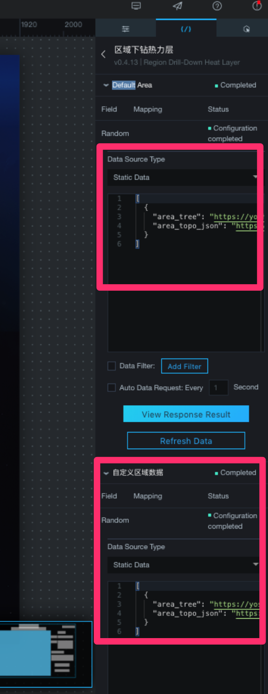

## How to use DataV Region Drill-Down Heat Layer

## Summary
0. [Introduction](#introduction)
1. [Prerequisite](#prerequisite)
2. [How to create a DataV project with Region Drill-Down Heat Layer](#How-to-create-a-DataV-project-with-Region-Drill-Down-Heat-Layer)
3. [How to create json setting files of Region Drill-Down Heat Layer](#How-to-create-json-setting-files-of-Region-Drill-Down-Heat-Layer)
4. [How to use widget interaction with Region Drill-Down Heat Layer](#How-to-use-widget-interaction-with-Region-Drill-Down-Heat-Layer)
5. [Support](#support)


## Introduction

The goal of this tutorial is to explain how to use Region Drill-Down Heat Layer (区域下钻热力层) in [DataV](https://www.alibabacloud.com/help/doc-detail/30360.htm). First, it explains how to create a new DataV project with Region Drill-Down Heat Layer. Second, it explains how to create json setting files of Region Drill-Down Heat Layer with the supporting tool step by step. Finally, it explains how to use widget interaction with Region Drill-Down Heat Layer. Please note that some words in DataV are only in Chinese currently. But don't worry. This tutorial will explain key words in both English and Chinese or using screenshots as possible.


## Prerequisite

### Alibaba Cloud

* Alibaba Cloud account

You need an Alibaba Cloud account. If you don't have any account, please follow
[this document to create one](https://www.alibabacloud.com/help/doc-detail/50482.htm).

### Local environment

* DataV Region Drill-Down Heat Layer verion (v0.4.13 +)

* [Node.js](https://nodejs.org/)

To run the supporting tool script, you have to install Node.js on your local machine. Please install it if you don't have. Otherwise, you need to create *"area_tree"* file and *"area_topo_json"* file manually.


## How to create a DataV project with Region Drill-Down Heat Layer

Let's create a Region Drill-Down Heat Layer.

In DataV console, there is no language menu. If you want to change the language, please select the language from [Alibaba Cloud main console page](https://home.console.aliyun.com/new#/) first. The language menu is at top-right corner.


1. Create a new DataV project

    First of all, you have to create a DataV project.

    1. Go to [DataV console](http://datav.aliyun.com/654/project) and create a new one by click *Create Project* Button.

    2. In the new project creation page, select a empty (空白) template, and click the *Create* button which appears when you hover the template. After a pop up will appear, then input your project name and click the *Create* button.

        

    3. After DataV project creation, you can see your project on DataV console. Open the new project by click *Edit* button which appears when you hover the project item.

        

2. Add a Basic flat map

    1. Add a Basic flat map

        At the top of edit page, there is a widget menu bar. Click the map icon and select Basic flat map to add it.

        

    2. Configure the Basic flat map

        Click the Basic flat map widget you added to select it. You can see a menu at the right side of the edit page. It contains components list in the map, basic attributes of the map, and global options of the map.

        You can configure the map in global options.

        If you will use the sample data of Southeast Asia data in [this repository](https://code.aone.alibaba-inc.com/imo/datav-region-drill-down-heat-layer), the following settings is recommended.
        * Zoom Level : around 4.7
        * Map Center Longitude : around 114
        * Map Center Latitude : around 8

        

3. Add a Basemap Layer

    1. Clean the component list

        By default, Basic flat map widget contains a Basemap Layer component. But it may contain other components. Click the Basic flat map widget you added to select it. Then, delete the components in the map except the Basemap Layer component by click trash icon which appears when you hover the component in the component list.

    2. Configure the Basemap Layer

        Select the Basemap Layer and change the properties.
        * Tile URL : "NormalGoogle" ("//{s}.tile.openstreetmap.org/{z}/{x}/{y}.png" by default)
        * Auto Refresh : OFF
        * Use Filter : OFF (ON by default)

        

4. Add a Region Drill-Down Heat Layer

    Click a **+** button at the left-top corner of the component list, select Region Drill-Down Heat Layer, and add it.

    

    Now, you have a map with Region Drill-Down Heat Layer. But the layer is not displayed because of no data. In the next step, this tutorial will show how to create the data.


## How to create json setting files of Region Drill-Down Heat Layer

Region Drill-Down Heat Layer in DataV requires two setting files, *"area_tree"* file and *"area_topo_json"* file. The format for each file is defined by DataV.

This is an example of *"area_tree"* file.
```json
[
  {
    "area_id": 1000000,
    "name": "Southeast Asia",
    "children": [
      {
        "area_id": 180000,
        "name": "Brunei",
        "children": [
          {
            "area_id": 180100,
            "name": "Belait",
            "children": [
              {
                "area_id": 180101,
                "name": "Bukit Sawat"
              },
              {
                "area_id": 180102,
                "name": "Kuala Balai"
              },
              {
                "area_id": 180103,
                "name": "Kuala Belait"
              },
              {
                "area_id": 180104,
                "name": "Labi"
              },
              {
                "area_id": 180105,
                "name": "Liang"
              },
              {
                "area_id": 180106,
                "name": "Melilas"
              },
              {
                "area_id": 180107,
                "name": "Seria"
              },
              {
                "area_id": 180108,
                "name": "Sukang"
              }
            ]
          },
          {
            "area_id": 180200,
            "name": "Brunei and Muara",
            "children": [
              {
                "area_id": 180201,
                "name": "Berakas A"
              },
              ...
```

This is an example of *"area_topo_json"* file.
```json
{
  "180000": {
    "type": "Topology",
    "objects": {
      "collection": {
        "type": "GeometryCollection",
        "geometries": [
          {
            "type": "Polygon",
            "properties": {
              "adcode": 180100,
              "name": "Belait",
              "subFeatureIndex": 0
            },
            "arcs": [
              ...
            ]
          },
          {
            "type": "MultiPolygon",
            "properties": {
              "adcode": 180200,
              "name": "Brunei and Muara",
              "subFeatureIndex": 1
            },
            "arcs": [
              ...
            ]
          },
          {
            "type": "MultiPolygon",
            "properties": {
              "adcode": 180300,
              "name": "Temburong",
              "subFeatureIndex": 2
            },
            "arcs": [
              ...
            ]
          },
          {
            "type": "Polygon",
            "properties": {
              "adcode": 180400,
              "name": "Tutong",
              "subFeatureIndex": 3
            },
            "arcs": [
              ...
            ]
          }
        ]
      }
    },
    "arcs": [
      ...
    ],
    "transform": {
      "scale": [
        0.00017442633511536304,
        0.00019121161218008608
      ],
      "translate": [
        114.1361084,
        4.02219915
      ]
    }
  },
  "180100": {
    "type": "Topology",
    "objects": {
      "collection": {
        "type": "GeometryCollection",
        "geometries": [
          ...
```

Let's create setting files.

1. Download KMZ file for each country

    First, you have to prepare map data files. We use public data from [GADM](https://gadm.org/download_country_v3.html). It has KMZ files for many countries, which is one of map data format. Each country has multiple level KMZ files.
    * level-0 : A country map data with country level. It can be used to **world level area data** for DataV.
    * level-1 : A country map data with province level. It can be used to **country level area data** for DataV.
    * level-2 : A country map data with city level. It can be used to **province level area data** for DataV.

    Please note that DataV requires all three level area data. **World level area data**, **country level area data**, and **province level area data**.

2. Convert each KMZ file to geoJSON file

    [OGRE](http://ogre.adc4gis.com/) can convert a KMZ file to a geoJSON file. Use it to get geoJSON files.

    1. Select a KMZ file by click Choose File button in Convert to GeoJSON section.

    2. Click Force download button.

    3. Click CONVERT TO GEOJSON button.

3. Create world level geoJSON

    You have to create world level geoJSON which contains multiple countries geoJSON data by merge files of country geoJSON. The tool [geojson-merge](https://github.com/mapbox/geojson-merge#cli) can do it.

    ```sh
    npm install -g @mapbox/geojson-merge
    geojson-merge file.geojson otherfile.geojson > combined.geojson
    ```

    After this step, you have world level geoJSON, country level geoJSON which contains map data with province level, and country level geoJSON which contains map data with city level.

4. Convert geoJSON(collection.json) to TopoJSON

    [Mapshaper](https://mapshaper.org/) can convert a geoJSON file to a TopoJSON file. Use it to get geoJSON files. 

    Please note that before you import geoJSON file you have to change its name to **collection.json**. It affects to TopoJSON property which DataV specifies.
    * Create TopoJSON for world level and country level

        To create a TopoJSON file, click the Export button at top-right corner to open menu, select **TopoJSON**, and export the file. Please save the output file with "t_${AREA_NAME}.json", for example "t_Brunei.json".
    * Create TopoJSON for province level
        1. Check province names of a country

            Copy the country level TopoJSON you created and put it into main/childrenAreaNameHelper/ directory with the name "t_area.json", then run following script in a terminal:

            ```bash
            node check_children_area_name.js
            ```

            You can check the file *t_area_children_name.json* or terminal output to see province names.
        2. Open console of mapshaper

            Click the Console button at top-right corner nearby Export button in mapshaper page.
        3. Filter the data into target province

            As mapshaper console tells, you can type "tips" to show its help if you want. Also, you can type "info" to check properties of geoJSON data, especially "NAME_1" property.

            Filter the map data by filter command. For example,

            ```bash
            filter 'NAME_1 == "Tutong"'
            ```
        4. Export TopoJSON file

            Click the Export button at top-right corner to open menu, select **TopoJSON**, and export the file. Please save the output file with "t_${AREA_NAME}.json", for example "t_Tutong.json".

    After this step, you have world level TopoJSON, country level TopoJSON which contains map data with province level, and province level TopoJSON which contains map data with city level.

    You can simplify the map data and decrease file size if needed. The simplify button is at top-right corner nearby Export button in mapshaper page.

5. Create *"area_tree"* file *"area_topo_json"* file

    1. Prepare input files for DataV map file generator

        Put your TopoJSON files into the proper country directory in gadm directory. The follwing diagram shows an example of directory structure.
        ```txt
        gadm/
          ├ brunei
          │  ├ t_Belait.json
          │  ├ t_Brunei_and_Muara.json
          │  ├ t_Temburong.json
          │  └ t_Tutong.json
          ├ malaysia
          │ ...
          └ southeast_asia
        ```

    2. Define adcodes for each area, ROOT_AREA, TARGET_AREAS in main/AreaCode.js

        For example:

        ```javascript
        'use strict'

        /** DEFINITION */
        /** The adcodes of city level are defined automatically with alphabetical order. */

        const SOUTHEAST_ASIA = {
          'Southeast Asia': 1000000,  // root (special)
          'Brunei': 180000,
          'Malaysia': 260000,
        };
        const BRUNEI = {
          'Belait': 180100,
          'Brunei and Muara': 180200,
          'Temburong': 180300,
          'Tutong': 180400,
        };
        const MALAYSIA = {
          'Johor': 260100,
          'Kedah': 260200,
          'Kelantan': 260300,
          'Kuala Lumpur': 260400,
          'Labuan': 260500,
          'Melaka': 260600,
          'Negeri Sembilan': 260700,
          'Pahang': 260800,
          'Perak': 260900,
          'Perlis': 261000,
          'Pulau Pinang': 261100,
          'Putrajaya': 261200,
          'Sabah': 261300,
          'Sarawak': 261400,
          'Selangor': 261500,
          'Trengganu': 261600,
        };

        exports.ROOT_AREA = SOUTHEAST_ASIA;
        exports.TARGET_AREAS= {
          SOUTHEAST_ASIA, BRUNEI, MALAYSIA
        };
        ```

    3. Run the following command:

        ```bash
        sh create_datav_map_file.sh
        ```

        Be careful that the output file must be large.

6. Upload files to your OSS

    Upload *"area_tree"* file and *"area_topo_json"* file to your OSS.

    

7. Change DataV Region Drill-Down Heat Layer settings

    Now, you can import and apply your area data to DataV.

    1. Select the data tab

        

    2. Configure the data source

        Second, you have to specified the file urls of *"area_tree"* file and *"area_topo_json"* file, which you uploaded at previous step. For example,

        自定义区域数据:
        ```json
        [
            {
                "area_tree": "https://xxx.oss-xxx-xxx.aliyuncs.com/area_tree.json",
                "area_topo_json": "https://xxx.oss-xxx-xxx.aliyuncs.com/area_topo_json.topo.json"
            }
        ]
        ```

    3. Configure the defalt area code

        Third, you have to set the default area code. It must be world level area's one. For example,

        Default Area:
        ```json
        [
            {
                "adcode": 1000000
            }
        ]
        ```

        

    4. Check the map

        Now, you can see the DataV Region Drill-Down Heat Layer is displayed on the map.

        


## How to use widget interaction with Region Drill-Down Heat Layer

Widgets of DataV can [interact](https://www.alibabacloud.com/help/doc-detail/53842.htm) with each other by using [callback ID](https://www.alibabacloud.com/help/doc-detail/73327.htm). The callback ID is a parameter which a widget sends to the other widget according to user actions. The parameter is a dynamic variable and can be used for data query in the target widget.

Currently, to run a SQL query using callback ID needs a database. If you don't have any database, please follow [this document](https://www.alibabacloud.com/help/doc-detail/26117.htm) to create one.

This tutorial will show two examples for widget interaction with Region Drill-Down Heat Layer.

### Interact with Text widget

This is a simple example for widget interaction.

1. Configure a callback ID settings to Region Drill-Down Heat Layer

    To send a callback ID from the Region Drill-Down Heat Layer, you have to define the parameter and bind some event trigger.

    1. Interactive configuration

        Select the Region Drill-Down Heat Layer component and change the properties in Settings tab to define callback ID.

        For example,
        * Double-Click Callback ID : "adcode"
        * Click Callback ID : "adcode"

        

    2. Click event configuration

        Select the Region Drill-Down Heat Layer component and change the properties in Interaction tab to bind some click events.

        For example,

        On Click of Region
        * Enable (check box) : ON
        * Field : adcode
        * Bound Variable : area_id

        On Double Click of Region
        * Enable (check box) : ON
        * Field : adcode
        * Bound Variable : area_id

        

        After the configuration, when the Region Drill-Down Heat Layer is clicked, it will get the *adcode* data value of clicked area, and it can be used as a callback ID.

2. Add a Title widget

    Like you did for the Basic flat map widget before, click the text icon in the widget menu bar at the top of edit page, and select a Title to add it.

    

3. Configure the Title widget

    After added a Title widget, let's create a query which uses callback ID.

    1. Select Data Source

        Select the Title widget and change the properties in Data tab to configure Data Source.

        Currently, to use SQL, you have to set Data Source Type to *Database* and select a database to Data Srouce. In this example, you can choose any database. If you don't have any Data Source, please create new one by following [this document](https://www.alibabacloud.com/help/doc-detail/64139.htm).

    2. Create SQL

        In the SQL section, input a query which uses the callback ID. The callback ID can be used as a variable by adding a colon in front of its name.

        For example,

        ```sql
        SELECT :area_id as value
        ```

    

4. Preview

    Now, you can preview the project you created. The preview button is an icon at the top-right corner in the edit page, or the top-right corner of the project menu in the project list page.

    The preview displays the map with the default area which you specified first. If you double click some area in the map, the map will be zoom up with selected area. Also, the Title widget will show area id that corresponds to the selected area.

    Congratulation! Now, you master how to create a map with DataV Region Drill-Down Heat Layer.

    

### Interact with Scatter layer and Points Heatmap Layer for their data query

This is an example closer to real use case. It supposed that you have a database which contains real data with corrdinate and area id definition. First,
we will set a callback ID in the Region Drill-Down Heat Layer, to send the parameter to the Scatter layer and the Points Heatmap Layer for their data query. Then, we will add a Scatter layer and a Points Heatmap Layer that are connected to the database and have SQL query with callback ID. As a result, the Scatter layer and the Points Heatmap Layer shows the data only in the specified area by user action.

1. Configure a callback ID settings to Region Drill-Down Heat Layer

    To send a callback ID from Region Drill-Down Heat Layer, you have to define the parameter and bind some event trigger.

    1. Interactive configuration

        Select the Region Drill-Down Heat Layer component and change the properties in Settings tab to define callback ID.

        For example,
        * Double-Click Callback ID : "adcode"
        * Click Callback ID : "adcode"

        

    2. Click event configuration

        Select the Region Drill-Down Heat Layer component and change the properties in Interaction tab to bind some click events.

        For example,

        On Click of Region
        * Enable (check box) : ON
        * Field : adcode
        * Bound Variable : area_id

        On Double Click of Region
        * Enable (check box) : ON
        * Field : adcode
        * Bound Variable : area_id

        

        After the configuration, when the Region Drill-Down Heat Layer is clicked, it will get the area data value of clicked area, and it can be used as a callback ID.

2. Add a Scatter layer and a Points Heatmap Layer

    Like you did for the Region Drill-Down Heat Layer component before, click a **+** button at the left-top corner of the component list, select Scatter layer (散点层) component and Points Heatmap Layer (点热力层), and add them.

3. Configure the Scatter layer and the Points Heatmap Layer

    After added components, let's create a query which uses callback ID.

    1. Select Data Source

        Select the Title widget and change the properties in Data tab to configure Data Source Type.

        Currently, to use SQL, you have to set Data Source Type to *Database* and select a database to Data Source. In this example, select the database which contains data with corrdinate and area id definition. If you don't have any Data Source, please create new one by following [this document](https://www.alibabacloud.com/help/doc-detail/64139.htm).

    2. Create SQL in the Scatter layer and the Points Heatmap Layer

        In the SQL section of each component, input a query which uses the callback ID. The callback ID can be used as a variable by adding a colon in front of its name.

        For example,

        ```sql
        (select lat, lng, concat('[', id, '] ', location, ' ', buy_time) as info from `xxx`.`xxx` where (:area_id is null or :area_id = 1000000 or :area_id is not null and mod(:area_id, 10000) = 0) and (case when :area_id is null or :area_id = 1000000 then true when :area_id is not null and mod(:area_id, 10000) = 0 then left(area_id, 2) = left(:area_id, 2) when :area_id is not null and mod(:area_id, 10000) <> 0 then left(area_id, 4) = left(:area_id, 4) end ) limit 10000) union all (select lat, lng, concat('[', id, '] ', location, ' ', buy_time) as info from `xxx`.`xxx` where (:area_id is not null and mod(:area_id, 10000) <> 0) and (case when :area_id is null or :area_id = 1000000 then true when :area_id is not null and mod(:area_id, 10000) = 0 then left(area_id, 2) = left(:area_id, 2) when :area_id is not null and mod(:area_id, 10000) <> 0 then left(area_id, 4) = left(:area_id, 4) end ));
        ```

        

4. Preview

    Now, you can preview the project you created. The preview button is an icon at the top-right corner in the edit page, or the top-right corner of the project menu in the project list page.

    The preview displays the map with the default area which you specified first. If you double click some area in the map, the map will be zoom up with selected area. Also, the Scatter layer and the Points Heatmap Layer will be displayed that correspond to the selected area.

    Congratulation! Now, you know how to create a map with DataV Region Drill-Down Heat Layer.

    
    

## Support

Don't hesitate to [contact us](mailto:projectdelivery@alibabacloud.com) if you have questions or remarks.
